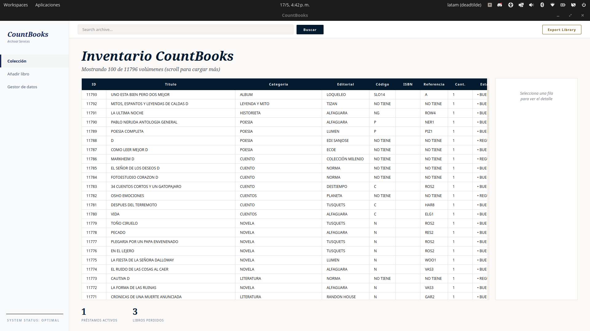
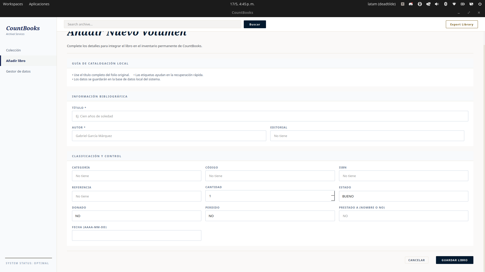
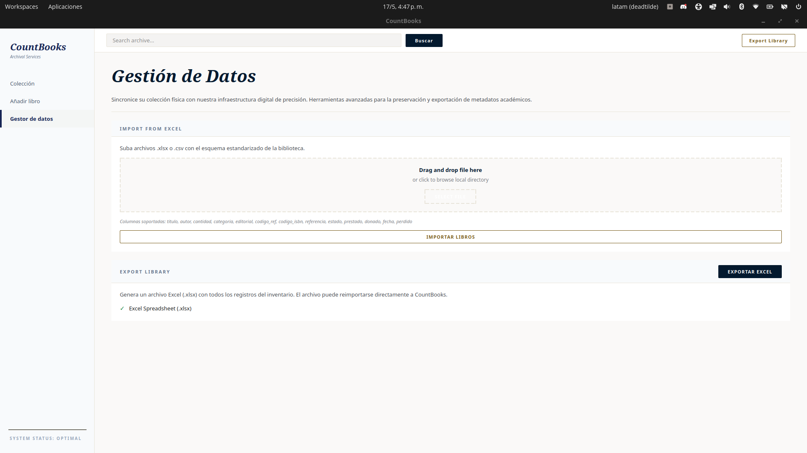

# CountBooks

CountBooks es un gestor de inventarios de libros pensado para bibliotecas personales y colecciones. Permite llevar control de préstamos, donaciones, pérdidas y la información detallada de cada libro.

---

## Requisitos

- Python 3.12+ recomendado
- `PySide6` para la interfaz gráfica
- `sqlite3` para la base de datos local
- `pyinstaller` para generar ejecutables

---

## Instalación para desarrolladores

### 1. Crear un entorno virtual

> Debe hacerse desde la carpeta raíz del proyecto `CountBooks`

#### Linux / macOS
```bash
python3 -m venv venv
```

#### Windows
```powershell
python -m venv venv
```

### 2. Activar el entorno virtual

#### Linux / macOS
```bash
source venv/bin/activate
```

#### Windows
```powershell
venv\Scripts\activate
```

### 3. Instalar dependencias

```bash
pip install -r requirements.txt
```

---

## Ejecutar la aplicación en desarrollo

Con el entorno activado, desde la carpeta raíz del proyecto:

```bash
python CountBooks.py
```

---

## Compilar para Linux

Para crear un ejecutable Linux usando PyInstaller:

```bash
pyinstaller --onefile --windowed CountBooks.py
```

El archivo generado quedará en `dist/CountBooks`.

---

## Compilar para Windows

Lo ideal es generar el `.exe` desde Windows.

1. Copia el proyecto a un equipo Windows.
2. Crea y activa un entorno virtual en Windows.
3. Instala dependencias:

```powershell
pip install -r requirements.txt
```

4. Ejecuta PyInstaller:

```powershell
pyinstaller --onefile --windowed CountBooks.py
```

El ejecutable quedará en `dist\CountBooks.exe`.

> Nota: compilar un `.exe` desde Linux no es recomendado. Si necesitas un ejecutable Windows, hazlo desde Windows o con un entorno de cross-compilación específico.

---

## Base de datos

La aplicación utiliza SQLite y crea automáticamente la base de datos en `~/.books/books.db`.

---

## Demo

CountBooks ofrece una interfaz clara para gestionar la colección de libros, registrar préstamos y mantener la información actualizada.

### Cómo se ve

- Pantalla principal con la lista de libros y botones para agregar, editar o eliminar.
- Formulario de registro de libro con campo de título, autor, categoría, estado y notas.
- Control de préstamos y devoluciones desde la misma ventana.

### Imágenes de ejemplo







---

## Contribución

Este proyecto es libre y abierto. Puedes contribuir mejorando la interfaz, agregando funciones o corrigiendo errores.

---

## Créditos

- Autor principal: `marcoszxdev`
- Contribución: `Jhosepthehacker`

